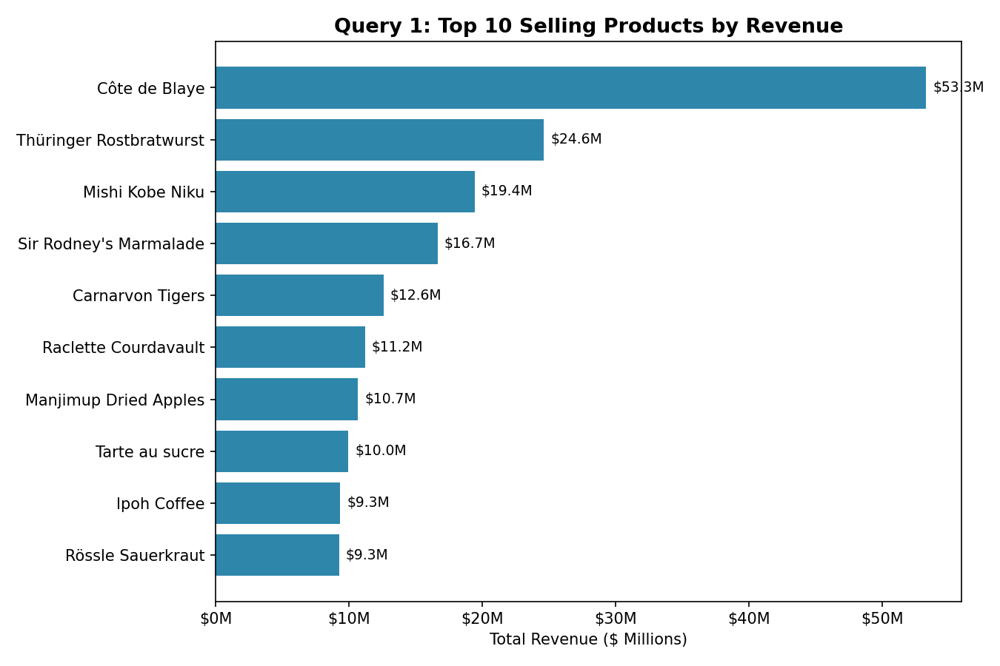
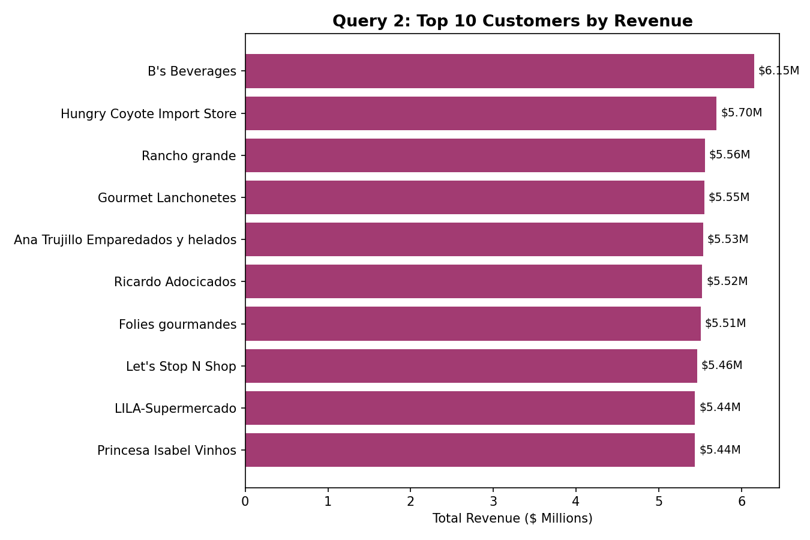
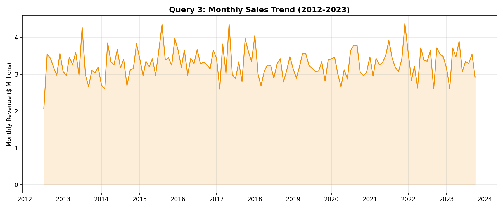
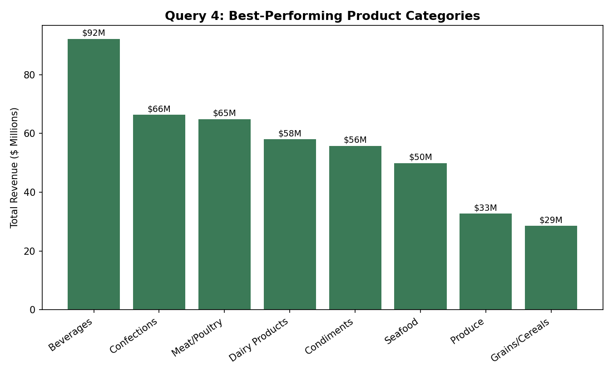
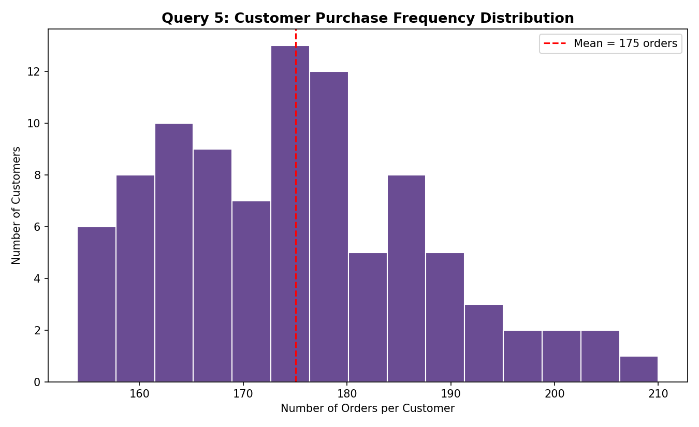

# Northwind SQL Analysis — Epochs Day 2

**Assignment 2 — Epochs: Data Science Bootcamp**
Tag: `#evn-ds-epochs26-day02`

## Database Overview

This project uses the [Northwind Database](https://github.com/jpwhite3/northwind-SQLite3) (SQLite fork), which models a wholesale food distributor: customers place orders, each order contains one or more line items (`Order Details`), and each product belongs to a category and comes from a supplier.

This particular fork is considerably larger than the classic textbook Northwind dataset:

| Table | Rows |
|---|---|
| Customers | 93 |
| Employees | 9 |
| Orders | 16,282 |
| Order Details | 609,283 |
| Products | 77 |
| Categories | 8 |
| Suppliers | 29 |
| Shippers | 3 |

Order dates span **July 2012 to October 2023** (~11 years). Data quality is clean — no null order dates, no null customer IDs, no orphaned product references, and no duplicate order-line keys.

## Business Questions

1. Which products generate the most revenue? → Top 10 products by revenue
2. Which customers are most valuable? → Top 10 customers by revenue
3. How does revenue trend over time? → Monthly sales aggregation
4. Which product categories perform best? → Revenue and units sold by category
5. How often do customers purchase? → Order count per customer, bucketed into frequency tiers

All queries are in [`queries.sql`](./queries.sql); full execution and Pandas analysis (including charts) is in [`analysis.ipynb`](./analysis.ipynb).

## SQL Output Visualized

### Query 1 — Top 10 Selling Products by Revenue

### Query 2 — Top 10 Customers by Revenue

### Query 3 — Monthly Sales Trend (2012–2023)

### Query 4 — Best-Performing Product Categories

### Query 5 — Customer Purchase Frequency Distribution

## Key Insights

1. **Revenue leadership is broad, not concentrated in one product.** Côte de Blaye leads at ~$53.3M — roughly double the next product — but from position 2 onward, revenue drops off gently rather than in a sharp long-tail curve, spreading risk across a real product portfolio rather than depending on one hero SKU.

2. **Customer revenue is remarkably evenly distributed, with no "whale" accounts.** The top 10 customers by revenue all sit in a tight $5.4M–$6.2M band. For a B2B distributor, this is unusual — real wholesale businesses typically show a handful of dominant accounts driving disproportionate revenue.

3. **Category performance is healthy across the board.** Beverages and Confections lead, Grains/Cereals trails, but the gap between the top and bottom category is only ~3.2x. No single category dominates the catalog, though Beverages' outsized share is worth monitoring for stockout risk.

4. **Every customer orders with almost identical frequency.** All 93 customers fall into the same 151–300 order bucket (mean 175, std dev ~12.7). Real-world purchase frequency is almost always right-skewed — a few frequent buyers, a long tail of occasional ones. This uniformity strongly suggests the dataset was synthetically expanded rather than reflecting organic customer behavior, and is worth flagging before using this pattern for any real business decision (e.g. loyalty tier design).

5. **Monthly revenue is flat across the full 11-year span.** Revenue fluctuates month to month (~$2.6M–$3.9M) but shows no sustained multi-year growth or decline. For a real distributor, over a decade without real-terms growth would be a red flag prompting questions about market saturation or the need for new growth initiatives.

## Repository Contents

- `queries.sql` — all 5 SQL analysis queries (plus a supporting frequency-distribution query)
- `analysis.ipynb` — SQL execution, Pandas analysis, and charts
- `README.md` — this file
- `screenshots/` — SQL output screenshots referenced above
- `northwind.db` — SQLite database (or see the GitHub link above)

## Tools Used

Python, SQLite3, Pandas, Matplotlib, Jupyter Notebook
